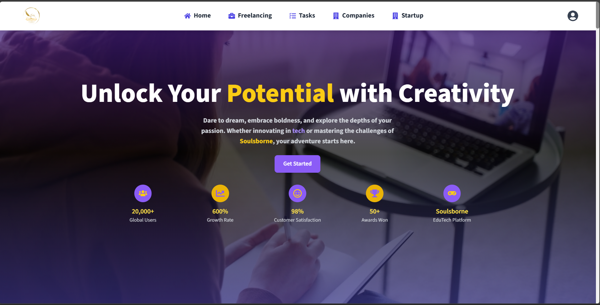
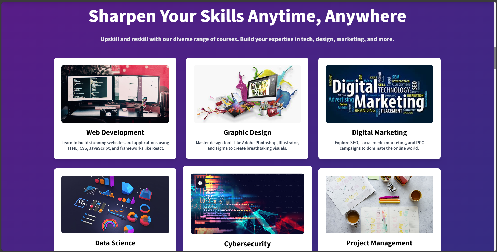
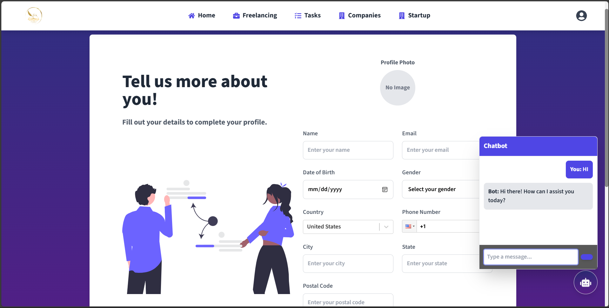
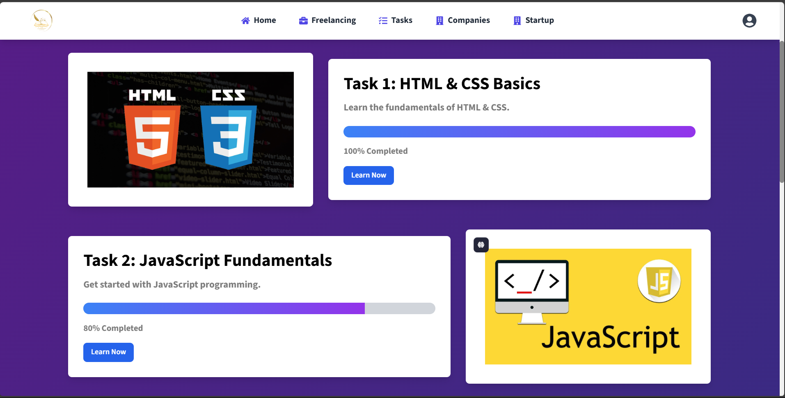
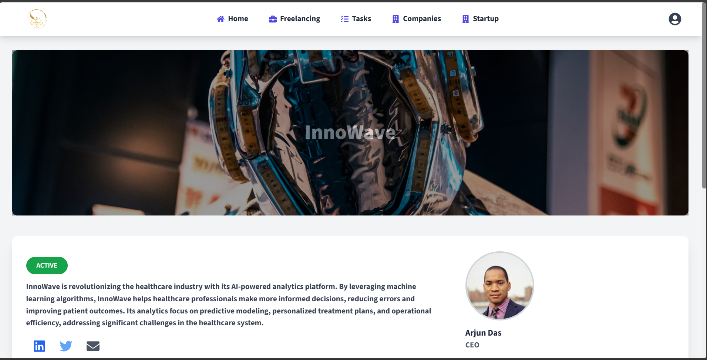

# ⚔️ **Soulsborne - Master Your Path to Greatness** ⚔️  

Soulsborne is a cutting-edge platform that empowers individuals to conquer procrastination, sharpen their skills, and excel in their personal and professional journeys. Inspired by the grueling yet rewarding experience of Soulsborne games, this platform helps you face challenges, break through barriers, and emerge victorious in life! 🎮🔥  

---

## 🚀 **Live Demo**  

🎉 Check out the deployed version of **Soulsborne** here:  
[🌐 **Soulsborne - Master Your Path to Greatness**](https://soulsborne-261a4.web.app/)  

---

## ✨ **Key Features**  

**Soulsborne** is your go-to platform for achieving success through focus, skill-building, and community. Here’s what makes it stand out:  

- 🎯 **Focus & Kill Procrastination**: Cut down procrastination like a boss with powerful productivity hacks and time-management techniques.  
- ⚔️ **Sharpen Your Skills**: Hone your skills and master various domains with our interactive skill-building quests.  
- 🎓 **Get Placed & Succeed**: Land your dream job with career guidance and resources tailored to your growth.  
- 💬 **Connect & Collaborate**: Forge new connections with like-minded people, exchange ideas, and grow together in this thriving community.  
- 🚀 **Stay Updated with Trends**: Never miss out on the latest tools, courses, and updates in your industry to keep you competitive and informed!
- 🤖 **Chatbot Assistance:** A smart assistant is now available in the Profile section to provide tips, guidance, and instant support!

---

## 🎨 **Mockups & Screenshots**  

Here’s a sneak peek into **Soulsborne**'s sleek design and functionality:  

### 🔮 **Landing Page Mockup**  
Showcasing the essence of conquering procrastination and self-growth.  

  

### 🎯 **Skills**  
Track your progress, master your skills, and achieve greatness.  

  

### 🤖 **Chatbot Assistance**  
A smart assistant is now available in the Profile section to provide tips, guidance, and instant support!  

  

### 📋 **Tasks Overview**  
Organize your to-dos with ease and stay on track.  

  

### 🚀 **Startup Guidance**  
Get inspired to launch your career with tailored resources.  

  

---

## 📂 **Project Folder Structure**  

We’ve organized the **Soulsborne** project for ease of use and navigation:  

```bash
Soulsborne/
├── public/                      
│   └── index.html                
├── src/                          
│   ├── assets/                   
│   ├── components/               
│   │   ├── BuildCompetitiveness.jsx  
│   │   ├── Connect.jsx                
│   │   ├── FocusAndKillProcrastination.jsx  
│   │   ├── Footer.jsx                 
│   │   ├── GetPlaced.jsx              
│   │   ├── Header.jsx                 
│   │   ├── Hero.jsx                   
│   │   ├── Navbar.jsx                 
│   │   ├── SharpenSkills.jsx          
│   │   ├── Slider.jsx                 
│   │   └── StayUpdated.jsx            
│   ├── pages/                    
│   │   ├── ForgotPassword.jsx     
│   │   ├── Home.jsx               
│   │   ├── Login.jsx              
│   │   ├── Profile.jsx            
│   │   ├── Signup.jsx             
│   │   └── Tasks.jsx
│   └── Company.jsx 
├── App.jsx                        
├── tailwind.config.js             
├── vite.config.js                 
└── package.json                   
```

---

## 💻 **Tech Stack**  

Here’s the powerful tech stack behind **Soulsborne**:  

- ⚛️ **React**: For building an interactive UI.  
- 💅 **Tailwind CSS**: Utility-first CSS for responsive designs.  
- 🎡 **Slick Carousel**: For smooth sliders.  
- 🎨 **FontAwesome**: Beautiful icons for enhanced visuals.  
- 🔥 **Firebase**: Real-time database and authentication.  
- 🖼️ **Framer Motion**: Elegant animations to bring the app to life.  

---

## 🚀 **Quick Start Guide**  

Ready to dive into **Soulsborne**?  

1. **Clone the repository**:  
   ```bash
   git clone https://github.com/johnwesley@755/soulsborne.git
   ```  
2. **Navigate to the project directory**:  
   ```bash
   cd soulsborne
   ```  
3. **Install dependencies**:  
   ```bash
   npm install
   ```  
4. **Run the development server**:  
   ```bash
   npm start
   ```  
5. **Open the app in your browser**:  
   [http://localhost:5173](http://localhost:5173)  

---

## 🏅 **Achievements & Ranking System**  

Unlock achievements and level up:  

- 🎖️ **Bronze Achiever**: First steps toward productivity.  
- 🥈 **Silver Slayer**: Excelling in skill-building.  
- 🥇 **Golden Champion**: Complete mastery over procrastination.  

---

## 📫 **Connect with Us**  

Have feedback or ideas? Let’s chat!  

- **📧 Email**: support@soulsborne.com  
- **🐦 Twitter**: [@SoulsborneOfficial](https://twitter.com/soulsborneofficial)  
- **💼 LinkedIn**: [Soulsborne](https://www.linkedin.com/company/soulsborne)  

---

Made with passion by the **Soulsborne Team**. 🖤👾  
